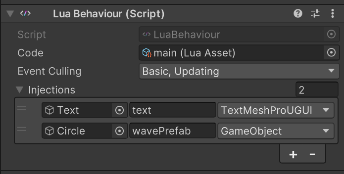

# Minity.XLuaTools

Encapsulates LuaBehaviour, enables visual component injection in the Inspector, supports automatic Lua script reloading during debugging, and allows runtime Lua script hot updates.

xLua: [Tencent/xLua: xLua is a lua programming solution for C# ( Unity, .Net, Mono) , it supports android, ios, windows, linux, osx, etc.](https://github.com/Tencent/xLua)

## **Setup**

This is part of the Minity framework. For the complete setup guide, please refer to:
[github.com/MorizeroDev/Minity](https://github.com/MorizeroDev/Minity)

## LuaBehaviour

Minity encapsulates **LuaBehaviour**, allowing Lua scripts to adapt to the **MonoBehaviour** lifecycle.

It also provides an intuitive **GameObject/Component injection setup**, which can be configured visually in the **Inspector**, reducing the need for extra C# script files and simplifying component access.



Additionally, it offers **Event Culling**, allowing you to select which **MonoBehaviour** events to receive as needed.

## LuaAsset

**LuaAsset** enables Unity to recognize `.lua` files natively. This means you can work with code editors more conveniently without having to develop scripts in `.txt` or `.bytes` format, saving development effort.

Furthermore, **LuaAsset** turns `.lua` files into Unity assets, allowing them to be managed and distributed using Unity’s asset-based resource management systems, such as **Addressables**.

**LuaAsset** also supports **automatic hot updates**. When you download an update patch and load it as a **LuaAsset**, it will automatically replace the corresponding Lua scripts in your project, including those that are already running.

For example, if you use **AssetBundles**, you can apply hot patches as follows:

```c#
var path = Path.Combine(Application.streamingAssetsPath, "path/to/your/bundle.bundle");
var bundle = await AssetBundle.LoadFromFileAsync(path);
var codes = bundle.LoadAllAssets<LuaAsset>();

foreach (var code in codes)
{
	code.ApplySubstitution();
}

await bundle.UnloadAsync(true);
```

When in **Play Mode**, **LuaAsset** (driven by a **ScriptableObject**) can also respond to changes in code files and reload them automatically.
